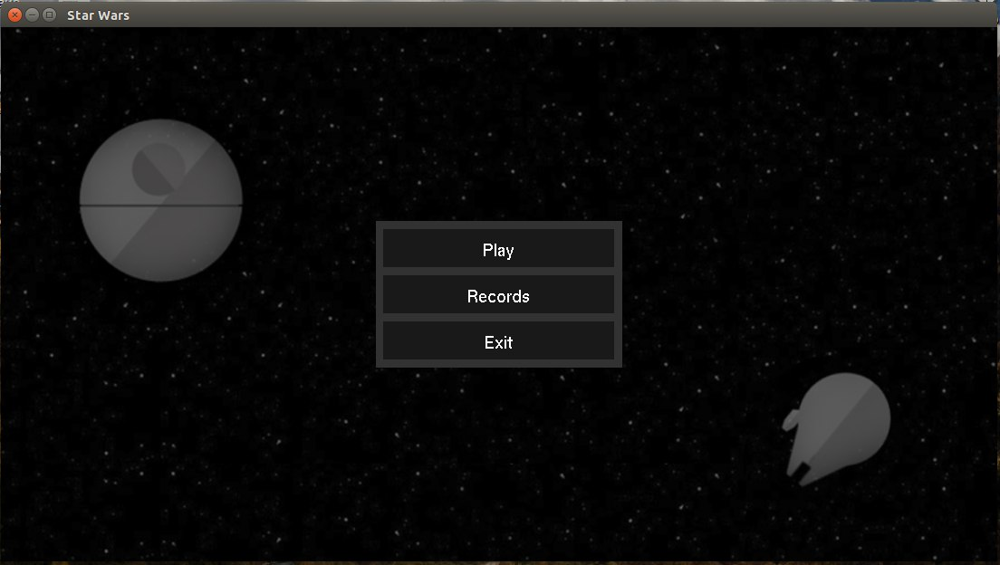
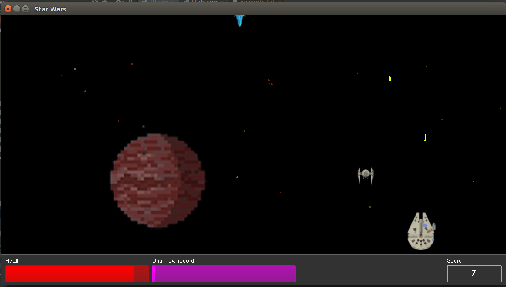
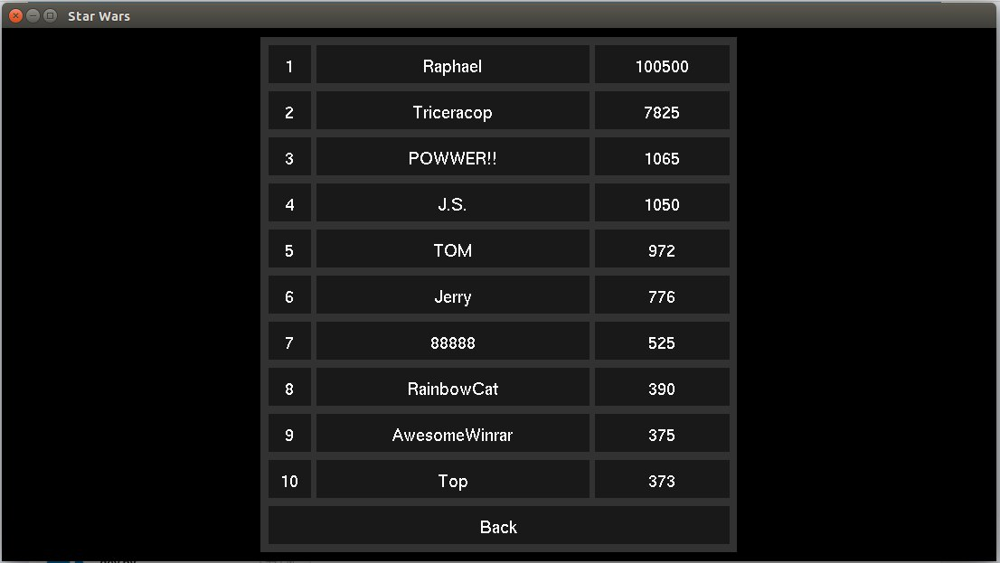

# Star Wars (Звездные войны)

*Курсовой проект на языке C++ с использованием OpenGL за третий семестр на факультете информационных технологий, ПГУ.*

## Задание

Задание для курсового проектирования № 80:
```
Разработка игровой программы «Звездные войны» Исходные данные: программа должна реализовать игру «Звездные войны» стандартного типа. Реализовать подсчет количества набранных баллов, а также ведение таблицы рекордов на десять записей.
```

## Описание
Приложение представляет собой простой 2D космический шутер с таблицей рекордов на 10 записей.
Игрок получает очки за уничтожение вражеских кораблей. Задача - набрать как можно больше очков.


> Main Menu


> Game Screen


> Record Table


### Основные компоненты
**Игрок** - игровой объект, способен перемещается вправо/влево, стрелять.

**Враг** - игровые объекты, появляющиеся в процессе игры, стреляют по игроку. Существуют в двух видах:
- TIE-Fighter - больше, агрессивнее и сильнее
- Blue-Guy - голубой :new_moon_with_face:


**Дроп-объект** - элементы игры, появляющиеся с некоторым шансом после смерти врага. Каждый дроп-объект обладает собственной вероятностью появления. Существуют в двух видах:
 - Health-Box :heart: - Восполняет здоровья игрока до максимума.
 - Bomb :bomb: - Уничтожает всех врагов с поля, засчитывая очки игроку.

**Задний фон** - динамически отрисовывает звезд и планеты.

## Пояснительная записка
Файл .docx пояснительной записки проекта находится в корневом каталоге репозитория - `Star-Wars.docx`.

## Реализация
Весь проект написан без использования ООП.
Всё рисование осуществляется с помощью [OpenGl](https://www.opengl.org/) (GLUT).
Работа с музыкой и звуками; загрузка .png текстур осуществляет при помощи [SFML](https://www.sfml-dev.org/).

## Модификация проекта
Основные настройки приложения и игрового процесса находятся в файле `./PREFERENCES.h`.

Архитектура проекта позволяет быстро и легко добавлять новых врагов (характеристики, рисование, логику), дроп-объекты (характеристики, рисование, действие); описывать новые типы снарядов и орудий; добавление новых звуков, музыки и тектур.

### 1. Добавление врагов
Флйлы отвечающие за работу с врагами находятся в директории `./modules/enemy/`.

**1)** Для использования нового типа врага необходимо сконфигурировать и зарегистрировать его в уникальном case в методе `getEnemy()` конфигуратора `.../utils/EnemyConfigurator.cpp`. Добавленный ID новой конфигурации врага необходимой заносить в массив типов `ENEMY_TYPES` в файле конфигуратора.

После добавления нового типа врага необходимо добавить методы рисования, стрельбы, и движения для данного типа (или указать уже существующие методы для нового типа).

**2)** Метод прицеливания должен возвращать значение true/false в зависимости от необходимости открывать врагом огонь. Логика метода прицеливания для соответствующего типа врага должна быть описана в файле `.../utils/aimer/Aimer.cpp`.

**3)** Метод рисования должен отображать графическое представление врага. Метод рисования для соответствующего типа врага должен быть описан в файле `.../utils/painter/Painter.cpp`.

**4)** Метод движения должен определять логику движения врага. Возвращать структуру `SW_Pos` содержащую сдвиг врага по полю. Метод движения для соответствующего типа врага должен быть описан в файле `.../utils/mover/Mover.cpp`.

### 2. Добавление дроп-объектов
Флйлы отвечающие за работу с дроп-объектами находятся в директории `./modules/drop/`.

**1)** Для использования нового типа дроп-объекта необходимо сконфигурировать и зарегистрировать его в уникальном case в методе `getDrop()` конфигуратора `.../utils/DropConfigurator.cpp`. Добавленный ID новой конфигурации дроп-объекта необходимой заносить в массив типов `WORLD_DROP_TYPES` в файле конфигуратора.

Для каждого дроп-объекта должен быть реализован метод рисования (или указан уже существующий) и действие при его активации.

**2)** Метод рисования должен отображать графическое представление дроп-объекта. Метод рисования для соответствующего типа должен быть описан в файле `.../utils/painter/Painter.cpp`.

**3)** Метод действия дроп-объект должен должен описывать логику игры при активации данного объекта. Тело метода для соответствующего типа дроп-объекта должно быть описано в файле `.../utils/action/Action.cpp`.

### Конфигурация снарядов и оружия
Файлы отвечающие за описания типов оружия и снарядов находятся в директориях `./gp-elements/gun/list` и `./gp-elements/bullet/list` соответственно. Добавление новых типов осуществляется описанием нового метода в файлах `gun-list.cpp` и `bullet-list.cpp`.

### Добавление ресурсов
Модули отвечающие за загрузку и обработку ресурсов (звуков, музыки, текстур), а также сами файлы ресурсов находятся в директорие `./resources`.
* Реализация загрузки и получения объекта текстуры должна осуществляется в методах модуля `TextureManager.cpp`.
* Загрузка и и воспроизведение музыки и звуков должна осуществляется в методах моделей `MusicManager.cpp` и `SoundManager.cpp` соответственно.

Для корректной работы ресурсных менеджеров, все файлы ресурсов должны быть расположены в директориях `/music`, `/sound` и `/texture`.


## Ооооо...
Вы можете использовать все файлы репозитория любым способом, в том числе и для сдачи курсового проекта. Ток меня не палите :3.

Писал, рисовал, билдил - Яблонский Андрей, 2017 г.

Отвечу на вопросы тут -  [](https://t.me/wiski_w) [](https://www.fb.com/wisklwiskl) [](https://vk.com/wiski_w)


> *SEO теги:\
Полоцкий государственный университет, ПГУ, PSU, psu.by, Факультет информационных технологий, курсач, курсовая работа, курсовой проект, Star Wars, звездные войны, opengl, glut, c++. cpp, c, си.*

